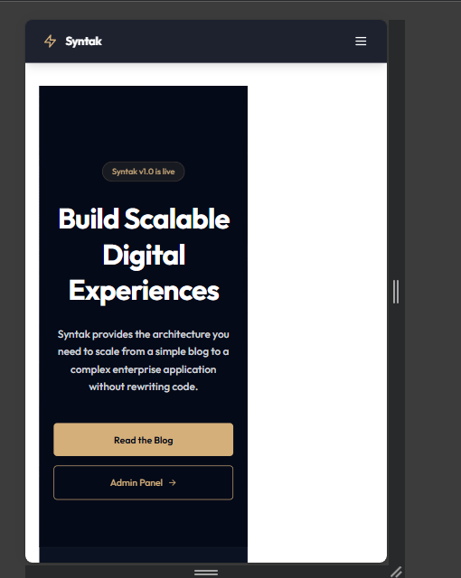

# Syntak - Scalable Digital Experiences

**Syntak** is a modern, high-performance web platform built to demonstrate the future of digital agencies. It combines a cutting-edge **Next.js 14** frontend with **Sanity CMS** for content management and integrated AI agents for automated support.



## 🚀 Features

- **⚡ Lightning Fast:** Built on Next.js 14 App Router with Server Components.
- **🎨 Premium UI:** Custom "Electric Blue" theme with Framer Motion animations.
- **📝 CMS Integrated:** Fully featured Sanity Studio embedded at `/studio`.
- **🤖 AI Powered:** Integrated Chat Widget using Vercel AI SDK and Gemini/OpenAI.
- **📱 Fully Responsive:** Optimized for all devices with a mobile-first approach.
- **🔒 Secure:** Authentication via Clerk (configurable) and environment protection.

## 🛠️ Tech Stack

- **Framework:** [Next.js 14](https://nextjs.org/)
- **CMS:** [Sanity v3](https://www.sanity.io/)
- **Styling:** [Tailwind CSS](https://tailwindcss.com/)
- **Animations:** [Framer Motion](https://www.framer.com/motion/)
- **AI:** [Vercel AI SDK](https://sdk.vercel.ai/)
- **Icons:** [Lucide React](https://lucide.dev/)

## 🏁 Getting Started

### Prerequisites

- Node.js 18+ installed
- A Sanity.io project ID
- Google Gemini or OpenAI API Key

### Installation

1. **Clone the repository:**
   ```bash
   git clone https://github.com/yourusername/syntak.git
   cd syntak
   ```

2. **Install dependencies:**
   ```bash
   npm install
   ```

3. **Set up Environment Variables:**
   Create a `.env.local` file in the root directory:
   ```env
   # Sanity Configuration
   NEXT_PUBLIC_SANITY_PROJECT_ID=your_project_id
   NEXT_PUBLIC_SANITY_DATASET=production
   
   # AI Configuration
   GOOGLE_GENERATIVE_AI_API_KEY=your_gemini_key
   ```

4. **Run the Development Server:**
   ```bash
   npm run dev
   ```

5. **Open the App:**
   - Frontend: [http://localhost:3000](http://localhost:3000)
   - Studio: [http://localhost:3000/studio](http://localhost:3000/studio)

## 📁 Project Structure

```bash
/src
  /app           # Next.js App Router
    /(marketing) # Global Website Pages (Home, About, Services)
    /(admin)     # Admin Dashboard Pages
    /api         # API Routes (Chat, etc.)
    /studio      # Embedded Sanity Studio
  /components    # Reusable React Components
  /features      # Feature-based architecture (Blog logic, etc.)
  /lib           # Utility functions and constants
  /sanity        # Sanity Schemas and Config
```

## 🎨 Theme Customization

The project uses a global CSS variable system defined in `src/app/globals.css`.
The primary brand color is **Electric Blue** (`#38bdf8`).

To change the theme:
1. Update CSS variables in `src/app/globals.css`.
2. Update Tailwind config if necessary.

## 🤝 Contributing

Contributions are welcome! Please fork the repository and submit a pull request.

## 📄 License

This project is licensed under the MIT License.
